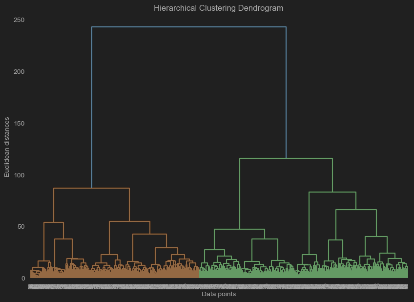
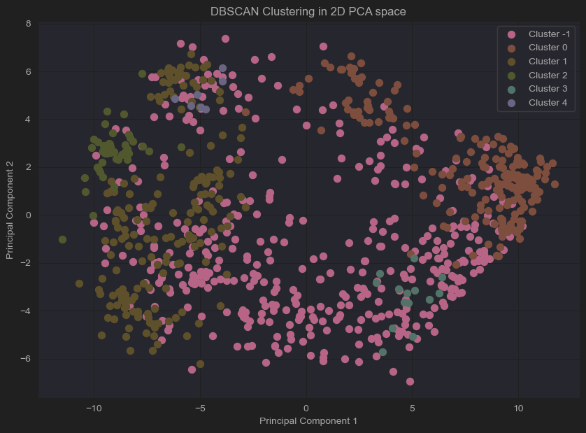

# Problem
The assignment four problem is to use data from two television networks DR and TV2, and use to analyse and build different models.
Here are the main goals of the assignment:
1. Analyse the data from both TV stations and create a political landscape
2. Analysis of the questions that are most crucial for the placement on the axes
3. Analysis of average responses of candidates in party for each question
4. Analysis of average age of the candidates grouped by parties
5. Analysis of the most confident agreeable and disagreeable candidates
6. Analysis of interparty and intra-party differences in responses
7. Creating classification models to predict party of candidate
8. Assess from the created model whether there are candidates in the wrong party
9. Create cluster analysis of candidates to cluster them into parties
10. Analysis of the most agreeable and most disagreeable elected candidates

# Preprocessing

The preprocessing of this assignment consisted of the following steps:
1. Loading the data from `alldata.xlsx` file into a variable.
2. Identifying null values
3. Mapping of the colours to the parties 

Overall the data was clean and did not require any preprocessing. This is due to the nature of the data - 
responses to questions between -2 and 2.

There has been also a preprocessing related to the problem statements mentioned above:
1. Dropping the qualitative columns before fitting the PCA - `navn`, `storkreds`, `alder`, `storkreds`
3. Dropping unnecessary columns, grouping the data by party, calculating the mean and sorting it in descending order for each question
4. Dropping unnecessary columns, grouping the data by party, calculating the mean and sorting it in descending order by age
5. Dropping unnecessary columns, summing up all responses for each candidate and sorting them in descending order for strong agreeable condaidates 
and in ascending order for strong disagreeable candidates
6. Dropping unnecessary columns, grouping the data by party, removing independent politicians `Løsgænger`, as they are expected to have the most internal disagreements and plotting the heatmap 
7. Dropping unnecessary columns, and splitting the data into train and test sets
10. Dropping unnecessary columns, and calculating the biggest and smallest difference between responses for each candidate combination

# Algorithms
* Plotting the political landscape
  * PCA (Principal Component Analysis)
    * Dimensionality reduction technique used for reducing the feature space into two dimensions, that describe the most variance in the data
      In our assignment, we have used PCA to find the key variables that are contributing to variance the most. Also, it was 
      useful to reduce the all the dimension (questions), so that a different clustering algorithms can be run on the components
      instead of all the questions, due to its ease of plotting the clusters in 2D space.
* Predicting party affiliation
  * Decision tree classifiers - Model that is very easy to interpret and could be used for explaining the model, as the
  output from the model is a tree, that contains all the decisions that the model has made. Also, it is very efficient
  when it comes to training and predicting.
  * Random Forest Classifier - Leverages the power of multiple decision trees, that are trained on different subsets of the data.
  The final prediction consist of average of all predictions from the randomly trained decision trees. The model is very robust
  and is not overfitting the data. The model is computationally expensive, as it is training multiple decision trees.
  * Gradient Boosting Classifier - Similar to Random Forest Classifier, but parallel training of decision trees is replaced with
    sequential training of decision trees. The model is also very robust.
* Clustering the political landscape
  * K Means Clustering - Uses centroids to cluster the data. K is the number of clusters that are expected to be found in the data.
  We have used it to identify patterns in the landscape and to identify the number of expected clusters.
  * Dendogram - Is a diagram with tree structure that is used to show the hierarchical relationship between the data points
  * DBSCAN - Uses densities in the data to cluster the data. The data points that are close to each other are considered to be in the same cluster,
  divided by a less dense area. The model is very robust and is not overfitting the data.

# Performance
* PCA
    * First component - Explains 45% of the variance
    * The loadings of the first component has been identified:
        1. Importance: 0,2054 - Index 531 - `Der skal indføres en særlig skat på de allerhøjeste indkomster`
        2. Importance: 0,2050 - Index 550 - `Der skal indføres kvoter, der sikrer mindst 30 procent kvinder i virksomheders bestyrelser`
        3. Importance: 0.1988 - Index 3b - `Ulandsbistanden bør hæves`
    * Second component - Explains 11% of the variance
        * The loadings of the second component has been identified:
            1. Importance: 0,3560 - Index 556 - `Den såkaldte Arne-pension skal afskaffes`
            2. Importance: 0,3550 - Index 10b - `Den såkaldte Arne-pension, der giver mulighed for tidligere pension, skal bibeholdes, selvom der er mangel på arbejdskraft.`
            3. Importance: 0.2988 - Index 551 - `Der skal være permanent grænsekontrol mellem Danmark og Tyskland`
* Decision Tree Classifier
  * Accuracy: 74%
* Random Forest Classifier
  * Accuracy: 89% 
* Gradient Boosting Classifier
  * Accuracy: 86%
* K Means Clustering
``
  Seemed to work well and divided the data successfully into n clusters.
* Dendogram

 Because we did not use any pruning nor stopping criteria, the dendrogram seemed to completely overfit the data, creating a
cluster for each data entry. 
* DBSCAN

The results of the DBSCAN were not very good, as the model did not identify clusters correctly. We have tried to manually
adjust the parameters, but the results were not good even after many attempts.

Overall for the predicting party affiliation, the best model was Random Forest Classifier, as it had the best accuracy and was the most robust.
The decision tree was the worst, which was expected due to its simplicity and the fact that it is prone to over fit.
The gradient boosting classifier was also very good in terms of performance, similar to the random forest classifier, which was expected due to the fact that
it is also building multiple decision trees. However, it was slightly worse than the random forest classifier.

# Reflection
Overall, the assignment was an opportunity to take real world use case and use the knowledge that we have gained 
during the classes in classes. We applied many techniques - PCA, clustering, and different types of decision trees.
The results from assignment has shown how important it is to correctly tune the hyperparameters of the models, as 
some of the used techniques were not able to produce good results. The political landscape is very divided, and we were able
to get more insights into the data to identify what questions are dividing the parties the most.